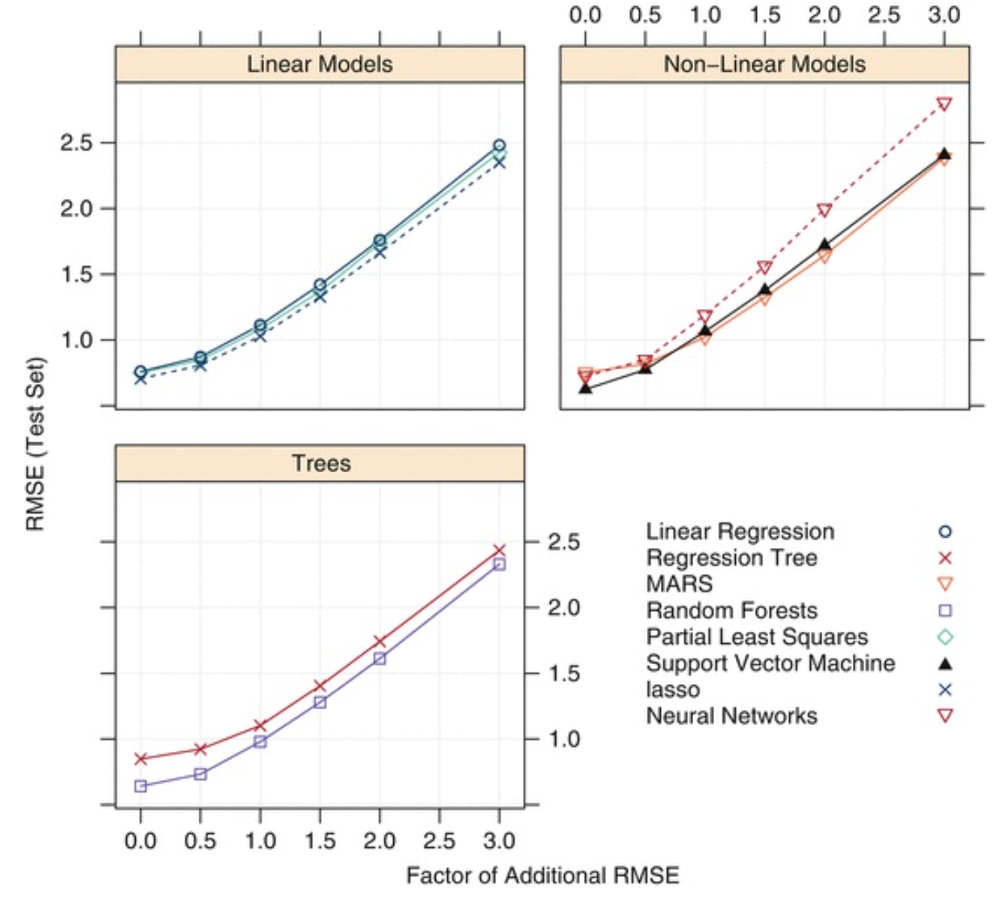
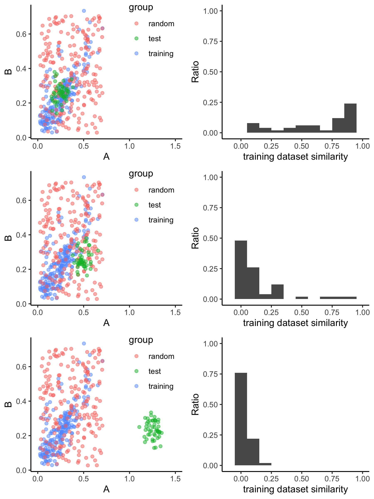

```{r include = FALSE}
library(AppliedPredictiveModeling)
library(tidyverse)
```
<style>
.forceBreak { -webkit-column-break-after: always; break-after: column; }
</style>

## Overview

* The Types of the Error or Noise
  - 측정시스템: feature 측정에서의 잡음
  - 비정보성 변수: outcome과 상관없는 변수가 모델링에 쓰일 때
  - 응답변수: label의 문제
  
## 20.1 Type III Errors(3종오류)
* Definition
  - 잘못된 질문에 대한 모델을 만든다.
  
cf. 

* Type I Error : False Positive
* Tyep II Error : False Negative

## 예시) 응답모델링
* 실제목표: 수익을 늘리는 것
* Basic Hypothesis
  - 단순히 만난 고객을 유효하게 만들고 모든 고객이 이 고객의 행동을 따라할 것이라고 가정
* Problems
  - 접촉한고객에 대해서만 이 고객이 구매할 확률을 예측하는 것밖에 할 수 없다. 
  - 전반적인 수익을 증가시킬 수가 없다.
  
##

<center>

</center>

* 매출 증대를 위해 B를 정확히 예측할 수 있는 모델이 가장 유용
* 모델의 문제점
  - 항상 응답하는 고객이 있기 때문에 응답률이 과추정될 수 있다. 
  - C나 D셀의 고객에게 프로모션을 보낼 경우 비용이 증가한다. 
* 해결방법
  - 접촉 없이 응답한 고객의 확률을 제거하는 방식
    $Pr[response|contact] - Pr[response|no\ contact]$
  - Paired or matched sampling(i.e. Case-control study design)
    
## 20.2 결과의 측정 오차
* 모델이 도달할 수 있는 최소 오차율?

<center>
$y_i = b_0 + b_1x_{i1} + b_2x_{i2} + \cdots + b_px_{ip} + e_i$
</center>

* $e_i \sim N(\mu, \sigma^2)$
* 최소오차(irreducible error) = 모델 오차 + 측정상의 오차 + $\sigma^2$

## e.g. Solubility dataset
```{r, echo=FALSE, out.width="40%", out.height = '40%', fig.align = 'default'}


```

1. 이런 유형의 잡음은 어떤 모델도 예측할 수 없음
1. 잡음이 증가할수록 예측 성능 측면에서 사실상 모델을 구별하기 어려워질 것

## 20.3 예측 변수에서의 측정 오차

* 전통적 통계 모델 - 일반적으로 예측 변수에는 오차가 없을 것을 가정
* 변수에 랜덤효과를 넣었을 때의 영향
  - 랜덤 정도
  - 변수 중요도
  - 사용한 모델 유형 등
  
  의 여러 요인에 따라 달라질 수 있다. 

## e.g. simulation data {.columns-2}


* simulation data
  + $y = sin(x), x \in [2, 10]$
* grey: original data 
* black: predicted data
* red: predicted model

<p class="forceBreak"></p>

```{r echo = FALSE, out.width = '85%'}

```


## 20.4 연속형 결과를 이산화하기

원래의 응답 변수가 연속형이더라도 이를 범주형 응답 변수화하기를 원함

이유)

1. 응답 변수의 내재된 분포가 실제로는 이정형태(bimodal distribution)

## 실제 분포

```{r echo = FALSE, out.width='50%', out.hegith='50%', fig.align = 'default'}


```

## 20.4 연속형 결과를 이산화하기

원래의 응답 변수가 연속형이더라도 이를 범주형 응답 변수화하기를 원함

이유)

1. 응답 변수의 내재된 분포가 실제로는 이정형태(bimodal distribution)
1. 실질적인 이유
    + 용해도의 경우 용해도의 실제적인 수치보다는 용해되는지 여부를 더 선호
1. 연속형 변수의 경우 오차율이 높고, 분포의 극단값에 있는 응답 변수만 범주화 가능
    + 3개의 범주로 나누고 중간범주는 모델 내에서 제거


### 연속형 결과를 이산화하는 경우 정보의 손실이 생긴다. 얼마나? 

## 정보의 손실 {.columns-2}
* A: linear/logistic regression
* B: SVM
* C: random forest

<p class="forceBreak"></p>

```{r echo = FALSE, out.width = '85%', out.height='85%'}

```

## 20.5 언제 모델의 예측값을 믿어야 할까
* 전제: 현재 존재하는 데이터를 만드는 방법과 동일한 방식으로 데이터를 계속 만들 것

* 새 데이터 데이터 생성 과정
  - 훈련 데이터와 같은 방법 - 새 데이터에 대해서도 적합한 예측을 할 것
  - 훈련 데이터와 다른 방법 
      + 외삽추정: 훈련 데이터 밖의 샘플을 모델을 사용해 예측하는 것
      + 외삽 추정에 대한 방향을 예측 변수 공간에서 이런 빈 내부 공간을 포함하는 것으로 확장할 필요가 있음

## 훈련데이터와 테스트 데이터의 유사성
### scatter plot(with PCA) or 변수간의 분포 파악
- 예측변수가 별로 없는 데이터인 경우 
  
```{r echo = FALSE}
data(solubility)
pca <- solTrainX %>% prcomp(scale = TRUE)
pca_train <- pca$x %>% 
  as.data.frame()
pca_test <- predict(pca, newdata = solTestX) %>% 
  as.data.frame()

dplyr::bind_rows(list(train = pca_train, test = pca_test), .id = 'group') %>%
  dplyr::select(group, PC1, PC2) %>%
  dplyr::mutate(group = factor(group, levels = c('train', 'test'))) %>%
  ggplot(aes(x = PC1, y = PC2)) + geom_point(alpha = 0.5) + theme_classic() + facet_wrap(group~.)
```

* 문제점
1. 공간 차원 증가에 따라 산점도 및 분포를 살펴보는 것은 매우 비효율적
1. 훈련 데이터 세트와 새 데이터의 변수 공간에 대해 제대로 이해하기 어려움
1. 불충분한 예측이 일어나는 변수 내 공간이 있을 수 있음

## 훈련데이터와 테스트 데이터의 유사성

### 모델 활용 도메인

예측에 사용할 새 데이터가 훈련 데이터와 충분히 유사하다면, 

이 데이터 값은 모델 성능 추정값(e.g. 정확도)을 평균적으로 따를 것이라 가정

## 훈련데이터와 테스트 데이터의 유사성

### 수치화(헤이스티 등 2008)
1. 원 모델의 변수 중요도를 구한 후, 상위 20개의 변수를 선택한다. 
1. 훈련 데이터 세트에서 이 변수들을 임의로 치환한다. 
1. 원래의 훈련 세트의 상위 예측 변수와 이 변수의 임의로 치환된 버전을 행 단위로 붙인다. 
1. 원룬련 세트의 행과 치환된 훈련세트의 행을 구분하는 분류 벡터를 만든다. 
1. 새로 만들어진 데이터에 대해 분류 모델을 훈련한다. 
1. 훈련 데이터 세트 클래스에 새 데이터가 속할 확률을 구하는 분류 모델을 만든다. 

##
```{r echo = FALSE, fig.align = 'center', out.width="50%", out.height='50%'}

```

## 
```{r echo = FALSE, fig.align = 'center', out.width = '45%', out.height = '45%'}

```

## 20.6 샘플이 클 때의 영향
* 사전 가정: 샘플이 많을수록 더 좋은 모델을 만들 수 있다
* 예측변수나 응답 변수에 잡음이 발생하면 샘플 수가 가져다주는 이점이 줄어든다. 
* 샘플의 수가 증가함에 따라 긍정적인 결과가 적게 나타난다.
  - First, many of the predictive models have significant computational burdens as the number of samples (and predictors) grows.
  - Second, there are diminishing returns on adding more of the same data from the same population.
```{r fig1, echo = FALSE, fig.height = 2, fig.width = 5, fig.align='right'}
library(ggplot2)
p <- ggplot(data = data.frame(x = c(-3, 3)), aes(x))
scurve <- function(x){
  y <- exp(x) / (1 + exp(x))
  return(y)
}

p + 
  stat_function(fun = scurve, n = 100) + 
  theme_bw() + 
  theme(axis.title.x = element_blank(),
        axis.ticks.x = element_blank(),
        axis.text.x = element_blank(),
        axis.title.y = element_blank(),
        axis.ticks.y = element_blank(),
        axis.text.y = element_blank(),
        )
```

